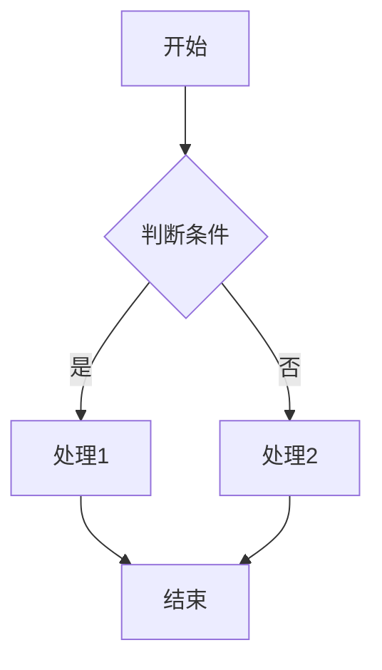
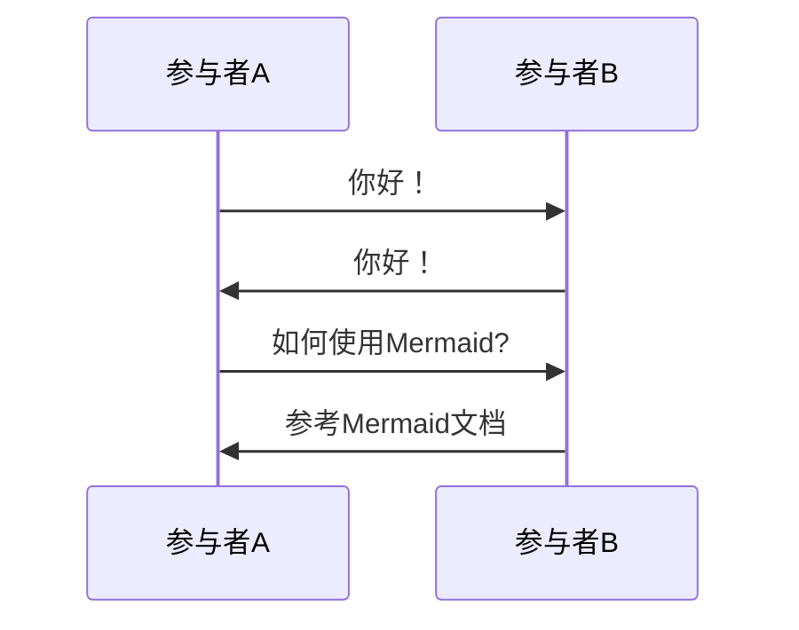

# Markdown 转图片工具

一个简单的基于Web的工具，可以将Markdown内容转换为PNG或JPG图片。

## 功能特点

- 实时Markdown预览
- 支持导出为PNG或JPG格式
- 支持Mermaid图表语法，可以绘制流程图、时序图等
- 全屏编辑模式，提供更大的工作区域
- 美观的GitHub风格Markdown渲染
- 导出完整内容，无论Markdown内容多长都能完整转换
- 响应式设计，适配各种屏幕尺寸

## 技术栈

- Vue 3
- TypeScript
- Vite
- marked (Markdown解析)
- mermaid (图表渲染)
- html-to-image (HTML转图片)
- file-saver (文件保存)
- github-markdown-css (样式)

## 使用方法

1. 克隆项目到本地
```bash
git clone https://github.com/yourusername/markdown-to-image.git
cd markdown-to-image
```

2. 安装依赖
```bash
npm install
```

3. 运行开发服务器
```bash
npm run dev
```

4. 构建生产版本
```bash
npm run build
```

## 本地使用

构建完成后，可以直接在浏览器中打开`dist/index.html`文件，或者使用任意HTTP服务器提供服务。

## Mermaid图表示例

该工具支持Mermaid语法，只需要在Markdown中使用```mermaid代码块即可：





更多Mermaid语法请参考[Mermaid官方文档](https://mermaid-js.github.io/mermaid/#/)。

## 使用场景

- 分享代码片段
- 创建社交媒体图片
- 生成包含富文本的图片
- 制作流程图、时序图等可视化图表
- 制作简单的图表和示意图
- 为技术文档生成图片

## 操作提示

- 使用右上角的刷新按钮可以重新渲染Mermaid图表
- 点击"全屏模式"按钮可以获得更大的编辑和预览区域
- 导出时会自动包含完整内容，无需担心内容被截断
